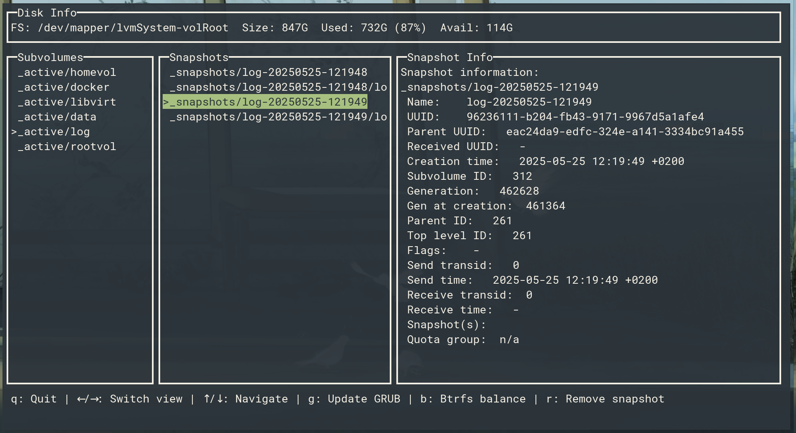

# butterfs



`butterfs` is a TUI for managing Btrfs snapshots. Create and delete snapshots with a single click.

## Features

- Text-based user interface
- Ability to create and delete snapshots
- Btrfs balance functionality
- Grub-mkconfig functionality

## Preferred subvolumes structure

```
_active
    _active/rootvol
    _active/homevol
    _active/log
_snapshots
    _snapshots/rootvol-20250525-112410
    _snapshots/rootvol-20250525-121931
```

## Dependencies

- `btrfs-progs`
- `df`

## Installation

To install `butterfs`, follow these steps:

1. Make sure you have Go installed (version 1.16 or higher).

2. Clone the repository:
   
   ```shell
   git clone https://github.com/MuratovAS/butterfs.git; cd butterfs
   ```

3. Build the project:
   
   ```shell
   go build -o butterfs
   ```

4. (Optional) Move the executable to a directory included in PATH for convenient access:
   
   ```shell
   sudo mv butterfs /usr/local/bin/
   ```

## Usage

After installation, you can use butterfs by specifying the path to the Btrfs partition:

```shell
sudo ./butterfs /mnt/defvol
#OR
sudo butterfs /path/to/btrfs/partition
```

You can override subvolume prefixes if needed.

```shell
SUBVOLUME_PREFIX="_active"
SNAPSHOT_PREFIX="_snapshots"
```

## Contributing

We welcome contributions to the project! If you'd like to contribute, please create a pull request or open an issue to discuss proposed changes.

## License

This project is distributed under the GPL-3.0 license. Additional information can be found in the LICENSE file.
